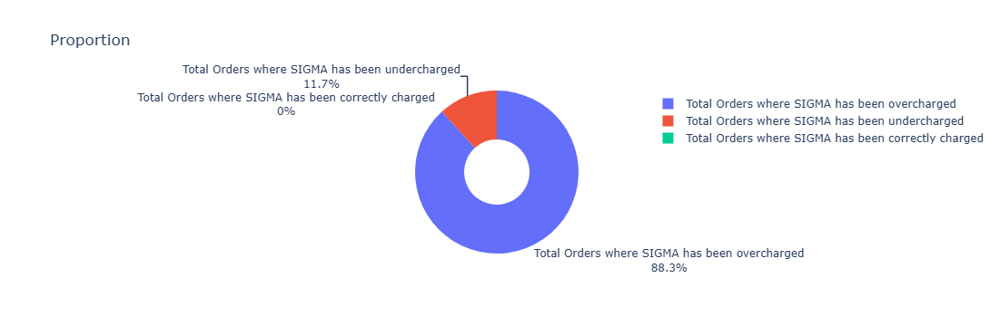

# E2E COURIER CHARGES ACCURACY ANALYSIS WITH PYTHON
<div align="center">
  
</div>

## Background Story:
<details>
  <summary>Click to expand</summary>
  <br>
Courier Companies also known as Logistics Companies are businesses that specialize in transporting packages, documents, and other goods from one location to another.  They offer a range of services, from same-day delivery within a city to international shipping across continents.  They manage the entire process, including pickup, transportation, tracking, and delivery, often using a combination of transportation modes like trucks, airplanes, ships, and trains.  They play a vital role in facilitating commerce and connecting businesses and individuals globally.
  
Courier charges are the fees you pay to a courier company for their services, which primarily involve picking up a package from one location and delivering it to another.
  
In today’s fast-paced e-commerce industry, fast and efficient order delivery is crucial to business success. To ensure seamless order fulfilment, businesses often partner with courier companies to ship their products to customers. However, managing the charges collected by these courier companies can be difficult, especially when dealing with a high volume of orders. It is one of the real-time problems Enterprise to Enterprise businesses experience when their estimated charges for the same invoice don’t match. In this project, I will take you through a solution to this problem statement based on this E2E Courier Charges Accuracy Analysis using Python.
</details>

## Project Objective:
<details>
  <summary>Click to expand</summary>
 <br>This project focuses on assessing the accuracy of fees charged by courier companies for the delivery of goods in Enterprise to Enterprise transactions. The goal is to ensure that companies are billed appropriately for the services provided by courier companies.
</details>

## Data Overview:
<details>
  <summary>Click to expand</summary>
 <br>This dataset provides a comprehensive view of courier operations and is comprised of five Excel files. These files contain detailed information on:

- Courier company rates
- Invoices
- Order reports
- Pincodes
- SKU master data

### Definitions:
<details>
  <summary>Click to expand</summary>
 <br>  
- fwd_a_fixed: (Fixed Forward Charge), a fixed cost for shipping a package from the origin to the destination. It's the primary fee for the courier service.
  
- fwd_a_additional: (Additional Forward Charge), an additional charge added to the standard shipping cost due to specific circumstances or service requirements such as special handling, remote area delivery, faster delivery service, fuel surcharge, etc.
  
- rto_a_fixed: (Return To Origin Fixed Charge), a fixed fee charged by the courier when a package has to be returned to the sender.  It's an extra cost incurred due to the failed delivery and the return process.
  
- rto_a_aditional: (Return To Origin Additional Charge), The key difference from "rto_a_fixed" is that this charge is not a fixed amount.  It's a variable charge added to the cost of returning the package and it only applies if an RTO occurs. Because it's not "fixed," the amount of the RTO charge will vary depending on some factors like distance of return, weight or dimension of package, courier policies, courier pricing structures, etc.
  
- AWB Code: (Air WayBill Code), a unique identification number assigned to each air shipment, like a tracking number for your package.  It contains vital information about the shipment and allows it to be tracked throughout its journey.

- ORDER ID: A unique number assigned to a specific order written in an invoice or shipping label.
  
- Charged Weight: Shipping costs are primarily determined by weight and size. Couriers use the "charged weight" to account for both the weight and size of your package and use it to decide how much to charge you for shipping.
  
- Warehouse Pincode: This is the pincode of the warehouse where the shipment originates. It's the starting point of the package's journey.
  
- Customer Pincode: This is the pincode of the customer's delivery address, where the package needs to be delivered. It's the destination of the shipment.
  
- Zone: Shipping zones are geographical areas that carriers use to calculate shipping rates and estimate delivery times. They are typically defined by distance from the origin of the shipment.
  
- Type of Shipment: The type of charges accrued based on the type of shipment being done. e.g forward charges or RTO charges.
  
- Billing Amount: Refers to the total amount the customer is charged for a shipment. It's the sum of all applicable charges.
  
- ExternOrderNo: Same as ORDER ID
  
- SKU(Stock Keeping Unit): It's a unique identifier assigned to a specific product or service to track all the products a retailer, wholesaler, or manufacturer has in stock, waiting to be purchased by customers.
  
- Order Qty: Order Quantity tells you how many of a particular product or item a customer has requested in their order.
  
- Weight: Weight is a primary factor in calculating shipping costs. Heavier packages generally cost more to ship.
</details>
</details>

## Tools and Libraries Used
<details>
  <summary>Click to expand</summary>
  <br>
  For this analysis, I utilized the following tools and libraries:

  * **Jupyter Notebook:** This interactive environment was used for writing, executing, and documenting the Python code, allowing for a clear and reproducible workflow.
  * **Pandas Python Library:** Pandas was employed for data manipulation, cleaning, and analysis. It facilitated tasks such as data loading, merging, filtering, and aggregation.
  * **Plotly Python Library (plotly.py):** Plotly was used for creating interactive and informative data visualizations, enabling effective exploration and communication of insights.
</details>

## Data Cleaning and Preparation

<details>
  <summary>Click to expand</summary>
  <br>

  In the initial data preparation phase, I performed the following tasks:

  1.  **Library Imports:**
      * Imported Pandas for data manipulation and analysis.
      * Imported plotly.

  2.  **Missing Value Handling:**
      * Checked for missing values using `isnull()` on all columns.
      * Found 0 missing values in all columns.

  3.  **Data Cleaning and Formatting:**
      * Renamed the 'ExternOrderNo' column to 'Order ID' to ensure consistency across datasets.
      * There was no need for date conversion.
      * There were no duplicates that needed to be removed.
      * All the columns were standardized.
      * Merged the 'Order Report' and 'SKU Master' datasets using an inner join based on the 'SKU' column.
      * To enrich courier invoice data, I extracted unique pin codes into a reference table, then subset the invoice data for relevant columns, and finally merge these two datasets     
        using the pin code as a key to create a combined dataset.
      * Merged the pin codes with the main dataframe creating a new dataframe called 'merged_2'.
      * Calculated the weight in kilograms by dividing the ‘Weight (g)’ column in the ‘merged2’ DataFrame by 1000.
      * Calculated the weight slab based on he weight of the weight of the shipment.
      * Renamed the columns 'Zone' in 'Courier Invoice' dataframe to 'Delivery Zone Charged by Courier Company'.
      * Renamed the column 'Zone' in the 'merged_2' dataframe to 'Delivery Zone As Per SIGMA'.
      * Renamed the column 'Weight Slab(KG)' in the 'merged_2' dataframe to 'Weight Slab As Per SIGMA'. All in na bit to get our desired 'merged_2' dataframe.
      * Calculated the Expected Charges As Per SIGMA.
      * Merged the updated 'merged_2' dataframe with the courier invoice to display the final dataframe.
      * Created 'Difference (NGN.)' column by subtracting 'Expected Charge as per SIGMA' column from 'Billing Amount (NGN.)' column.
      * Summarized the accuracy of E2E courier charges based on the charged prices and expected prices as per SIGMA.

</details>

## Exploratory Data Analysis(EDA):
<details>
  <summary>Click to expand</summary>
 <br>

  The primary objective of this EDA was to investigate the accuracy of courier charges. We aimed to determine the number of orders that were correctly charged, overcharged, and undercharged, and to identify potential factors contributing to charge discrepancies.

  **Methodology:**

  We used the Pandas library to manipulate and analyze the data. We calculated charge differences by comparing the actual charges from the courier invoices with the expected charges calculated based on our own rate tables. We then used Plotly to visualize the distribution of charge differences, zones with overcharged orders and weight slab differences.

  **Key Findings:**

  * **Charge Differences:**
      * We found that 354 orders were overcharged, resulting in a total overcharge amount of NGN 23,742,040.
      * 47 orders were undercharged, with a total undercharge amount of NGN 1,242,780.
      * No orders were correctly charged.
  * **Distribution of Differences:**
      * The distribution of charge differences was skewed towards positive values, indicating a tendency for overcharging.
      * 
  * **Delivery Zones:**
      * We observed a higher frequency of overcharged orders in specific delivery zones.
      * 
      * The chart above shows that delivery zones d and e were overcharged by courier companies.
  * **Weight Differences:**
      * We found differences between the 'Weight slab charged by Courier companies' and 'Weight slab as per SIGMA', which contributed to charge differences.
      * 

  **Insights:**

  The EDA revealed a significant issue with overcharging. Further investigation is needed to identify the root causes of these discrepancies and implement corrective measures.

</details>

## Data Analysis
<details>
  <summary>Click to expand</summary>
 <br>

This section details the analytical processes performed to compare courier company charges with expected charges calculated based on our internal standards.

**Key Analytical Steps:**

1.  **Data Integration:**
    * Utilized `pd.merge()` to combine data from the courier invoice and pincode mapping datasets, enriching the invoice data with customer pincode information.
    * This integration was crucial for linking order details with geographical data.
    * Code:
        ```python
        sigma_courier = pincode_mapping.drop_duplicates(subset=['Customer Pincode'])
        courier_sigma= courier_invoice[['Order ID', 'Customer Pincode','Type of Shipment']]
        pincodes= courier_abc.merge(abc_courier,on='Customer Pincode')
        print(pincodes.head())
        ```

2.  **Weight Slab Calculation:**
    * Defined a `weight_slab()` function to determine the weight slab for each shipment based on its weight.
    * This function rounded weights to the nearest 0.5 kg increment, following standard courier industry practices.
    * Code:
        ```python
        def weight_slab(weight):
            i = round(weight % 1, 1)
            if i == 0.0:
                return weight
            elif i > 0.5:
                return int(weight) + 1.0
            else:
                return int(weight) + 0.5

        merged2['Weight Slab (KG)'] = merged2['Weights (Kgs)'].apply(weight_slab)
        courier_invoice['Weight Slab Charged by Courier Company']=(courier_invoice['Charged Weight']).apply(weight_slab)
        ```

3.  **Expected Charge Calculation:**
    * Implemented a calculation to determine the expected shipping charges based on our internal rates (SIGMA).
    * This calculation considered factors such as:
        * Delivery zone
        * Weight slab
        * Type of shipment (forward or forward and RTO)
        * Courier company rate tables.
    * The results were stored in a new column, 'Expected Charge as per SIGMA'.
    * Code:
        ```python
        def calculate_expected_charge(row, courier_company_rates):
            fwd_category = 'fwd_' + row['Delivery Zone As Per SIGMA']
            fwd_fixed = courier_company_rates.at[0, fwd_category + '_fixed']
            fwd_additional = courier_company_rates.at[0, fwd_category + '_additional']
            rto_category = 'rto_' + row['Delivery Zone As Per SIGMA']
            rto_fixed = courier_company_rates.at[0, rto_category + '_fixed']
            rto_additional = courier_company_rates.at[0, rto_category + '_additional']
            weight_slab = row['Weight Slab As Per SIGMA']
            additional_weight = max(0, (weight_slab - 0.5) / 0.5)

            if row['Type of Shipment'] == 'Forward charges':
                return fwd_fixed + additional_weight * fwd_additional
            elif row['Type of Shipment'] == 'Forward and RTO charges':
                return fwd_fixed + additional_weight * (fwd_additional + rto_additional)
            else:
                return 0

        merged2['Expected Charge as per SIGMA'] = merged2.apply(lambda row: calculate_expected_charge(row, courier_company_rates), axis=1)
        print(merged2.head())
        ```

4.  **Charge Difference Analysis:**
    * A 'Difference (NGN.)' column was created by subtracting the 'Expected Charge as per SIGMA' from the 'Billing Amount (NGN.)' from the courier invoice.
    * This column was used to analyze any differences between the two charge amounts.

**Purpose:**

These analytical steps were performed to identify differences between the courier company's charged amounts and our expected charges, allowing us to assess the accuracy and efficiency of the courier services.
</details>

## Results & Findings:
<details>
  <summary>Click to expand</summary>
 <br>

After comparing the courier company's billed charges with our expected charges (SIGMA), we identified the following discrepancies:

**Key Findings:**

* Notably, there were no orders where the courier's charges perfectly matched our expected SIGMA charges.

| Description                                      | Count | Amount (NGN.) |
| :------------------------------------------------ | :---- | :------------ |
| Orders with Correct Charges (Matching SIGMA)       | 0     | 0.0           |
| Orders with Overcharges (Courier Exceeds SIGMA)   | 354   | 23,742,040.0  |
| Orders with Undercharges (Courier Below SIGMA)    | 47    | -1,242,780.0   |

**Summary:**

The analysis reveals that a significant number of orders (354) were overcharged by the courier company, resulting in a substantial financial impact. Conversely, a smaller number of orders (47) were undercharged. This data highlights the need for a review of the courier's billing practices and potential renegotiation of rates.
</details>

## Recommendations for Improving Courier Charge Accuracy:
<details>
  <summary>Click to expand</summary>
 <br>

**Investigate Overcharging Discrepancies:**

* Conduct a thorough investigation into the 354 overcharged orders.
* Identify the root causes of the overcharging (e.g., incorrect weight calculations, incorrect zone assignments, system errors).
* Analyze the patterns in the overcharged orders (e.g., specific delivery zones, package types, courier services).

**Implement Corrective Actions:**

* Develop and implement corrective measures to prevent future overcharging.
* This may involve:
    * Auditing and improving the accuracy of weight and dimension calculations.
    * Verifying and correcting zone assignments.
    * Enhancing system checks and validations.
    * Providing additional training to staff involved in charge calculations.
    * Consider implementing automated checks to verify charges against expected rates.

**Address Undercharging:**

* While the undercharging amount is less significant, investigate the 47 undercharged orders to ensure there are no systematic errors.
* Consider if the undercharging is due to any promotional activities.

**Improve Transparency and Communication:**

* Provide clear and detailed invoices to customers, showing how charges are calculated.
* Establish a process for customers to dispute charges and resolve discrepancies promptly.
* Consider publishing the rate calculation methodology.

**Strengthen Internal Controls:**

* Implement stronger internal controls to ensure the accuracy of courier charges.
* Conduct regular audits of courier charge calculations.
* Consider implementing a system for independent verification of charges.

**Negotiate with Courier Companies:**

* Use the analysis findings to negotiate better rates or service level agreements with the courier companies.
* If systematic errors are found with a specific courier, consider switching to a more reliable provider.

**System Improvements:**

* If the data is entered manually, look at the UI/UX for ease of use, and reduce manual errors.
* Look at the API connection to the courier companies to ensure data is transferred correctly.

**Focus on Customer Satisfaction:**

* Overcharging can lead to customer dissatisfaction and loss of business.
* Prioritize accuracy in courier charges to improve customer trust and loyalty.
</details>

## Limitations:
<details>
  <summary>Click to expand</summary>
 <br>
    
- Data Inconsistency and Preparation: The original datasets exhibited inconsistencies in column naming conventions. To ensure data organization and completeness, it was necessary to rename several columns. For example, 'ExternOrderNo' in the Order Report Dataset was renamed to 'Order Id' to align with other datasets. Similarly, 'Zone' and 'Weight Slab (KG)' columns were renamed to provide more descriptive and consistent labels across the dataframes.
  
- Data Preprocessing: A significant portion of the project involved data preprocessing to address inconsistencies in column naming. This step was crucial for accurate data merging and analysis. Notable changes included renaming 'ExternOrderNo' to 'Order Id' and standardizing zone and weight slab column names.
  
- Challenges Faced: Data integration presented challenges due to variations in column naming across datasets. To overcome this, columns such as 'ExternOrderNo' (Order Report) and 'Zone' (Courier Invoice, merged2) were renamed to ensure uniformity and facilitate data analysis.
</details>


